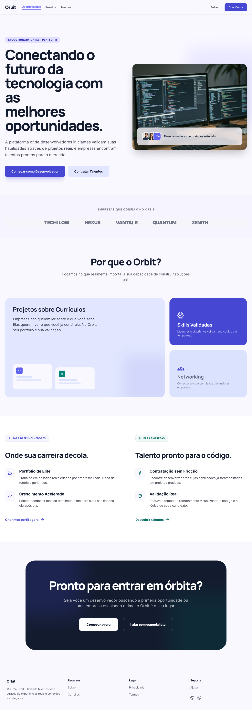
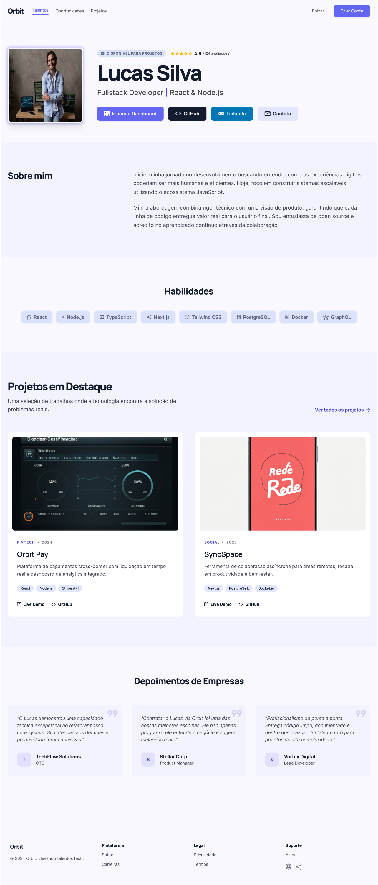
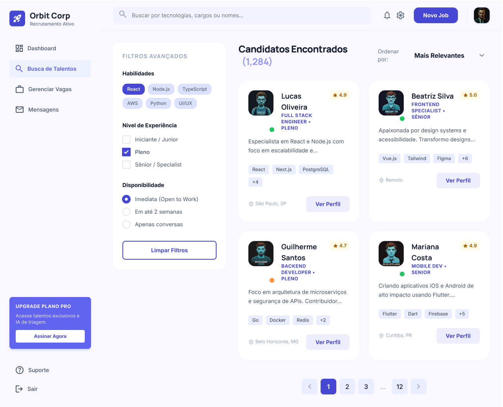
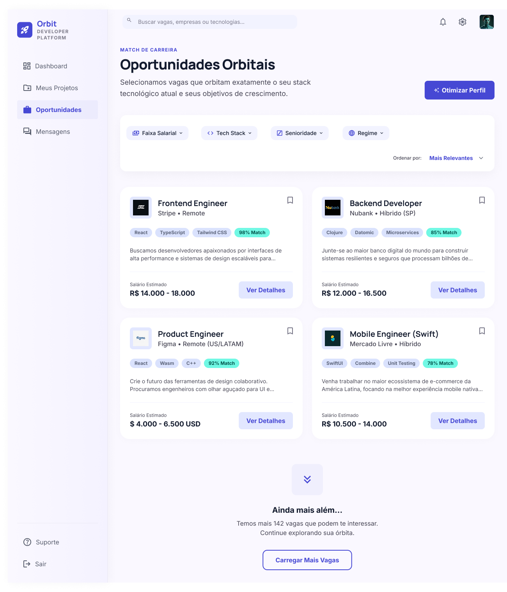
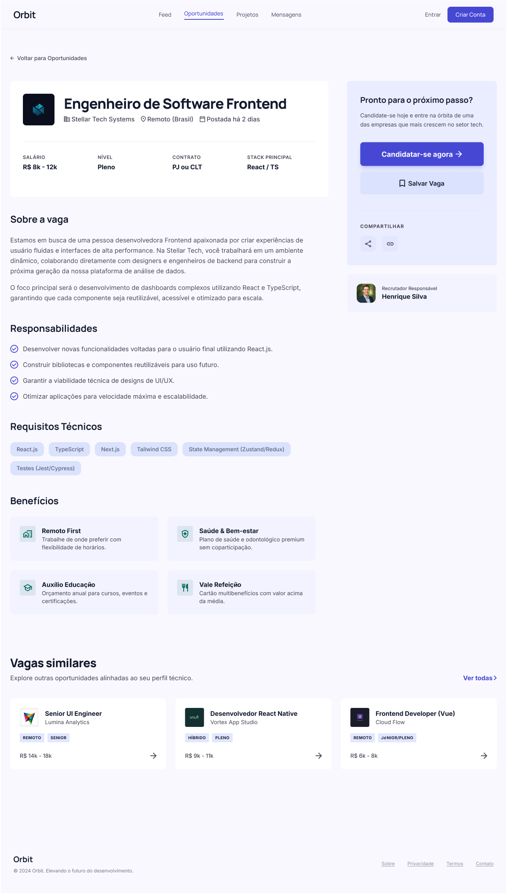
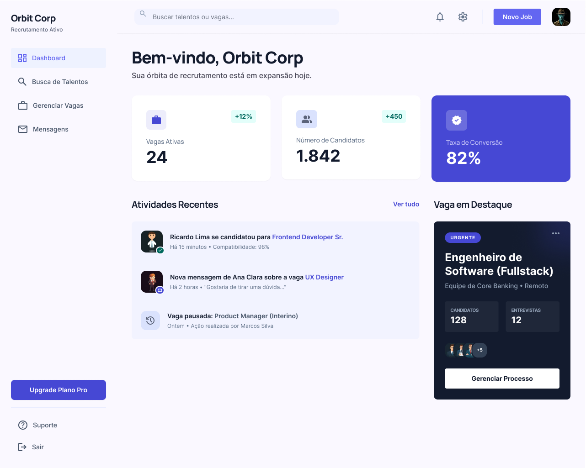

 # ORBIT - Documentação do Projeto

## 1. Contexto
## Introdução

O avanço da tecnologia tem transformado significativamente o mercado de trabalho, especialmente na área de desenvolvimento de software. Com o crescimento da demanda por profissionais qualificados, cada vez mais pessoas buscam ingressar nesse setor por meio de cursos, graduação e estudos autodidatas.

No entanto, apesar desse cenário favorável em termos de oportunidades, ainda existem desafios relevantes relacionados à inserção de novos profissionais no mercado. Muitos indivíduos, principalmente em início de carreira, encontram dificuldades para se destacar, validar suas habilidades e conquistar suas primeiras oportunidades. Nesse contexto, torna-se necessário compreender melhor essas dificuldades e investigar possíveis formas de mitigá-las por meio de soluções tecnológicas.

---

## Problema

Atualmente, um dos principais problemas enfrentados por profissionais iniciantes na área de tecnologia é a dificuldade de inserção no mercado de trabalho. Mesmo com o aumento da demanda por desenvolvedores, muitos candidatos não conseguem acessar oportunidades devido à falta de experiência prática, baixa visibilidade e ausência de conexões profissionais.

Além disso, há uma forte dependência de indicações e redes de contato, o que pode limitar o acesso de novos profissionais que ainda não possuem networking consolidado. Outro fator relevante é a dificuldade de demonstrar habilidades técnicas de forma eficiente, já que muitos processos seletivos ainda se baseiam em currículos tradicionais, que nem sempre refletem a capacidade real do candidato.

Segundo a BRASSCOM (2023), o Brasil pode enfrentar um déficit de mais de 500 mil profissionais de tecnologia até 2025, o que evidencia uma alta demanda não atendida no setor. Ainda assim, dados do IBGE indicam que jovens e pessoas com menor acesso a recursos educacionais enfrentam maiores dificuldades de inserção no mercado de trabalho, demonstrando que o problema não está apenas na falta de vagas, mas também na dificuldade de conexão entre profissionais e oportunidades.

Esse problema se insere em um contexto digital, no qual diversas plataformas já existem para recrutamento e networking, mas muitas delas não são totalmente eficazes para iniciantes, pois priorizam experiência prévia ou exigem um nível de maturidade profissional ainda não alcançado por esse público.

Para compreender melhor esse cenário, o grupo considerou abordagens como Design Thinking, utilizando ferramentas como brainstorming e matriz CSD (Certezas, Suposições e Dúvidas), que auxiliaram na identificação dos principais pontos críticos relacionados ao problema.

---

## Objetivos

### Objetivo Geral

Desenvolver uma aplicação web que contribua para a conexão entre profissionais da área de tecnologia e oportunidades de trabalho, buscando reduzir as dificuldades de inserção no mercado enfrentadas por iniciantes.

---

### Objetivos Específicos

- Investigar os principais fatores que dificultam a entrada de profissionais iniciantes no mercado de tecnologia  
- Aplicar conceitos de desenvolvimento web (HTML, CSS e JavaScript) na construção de uma interface funcional  
- Explorar formas de apresentar habilidades técnicas por meio de projetos práticos  
- Simular um ambiente digital que favoreça a interação entre profissionais e possíveis contratantes  

---

## Justificativa

A escolha deste tema se justifica pela relevância do problema no cenário atual do mercado de tecnologia. Apesar da crescente demanda por profissionais da área, muitos iniciantes ainda enfrentam barreiras significativas para conquistar suas primeiras oportunidades, o que evidencia uma lacuna entre formação e empregabilidade.

Além disso, o desenvolvimento deste projeto permite a aplicação prática dos conhecimentos adquiridos ao longo do curso, especialmente no que diz respeito às tecnologias de front-end. A proposta também apresenta potencial impacto social, ao buscar facilitar o acesso a oportunidades e promover maior inclusão no mercado de tecnologia.

A relevância do problema é reforçada por dados de instituições como a BRASSCOM, que aponta o crescimento da demanda por profissionais de tecnologia, e o IBGE, que evidencia dificuldades estruturais na inserção de jovens no mercado de trabalho.

---

## Público-Alvo

O público-alvo do projeto é composto principalmente por pessoas em início de carreira na área de tecnologia, incluindo estudantes, desenvolvedores iniciantes e profissionais em processo de transição de carreira.

Esses usuários, em geral, possuem conhecimentos básicos ou intermediários em programação e já tiveram algum contato com ferramentas tecnológicas, mas ainda enfrentam dificuldades relacionadas à visibilidade, experiência prática e inserção no mercado de trabalho. São indivíduos que utilizam frequentemente recursos digitais, como plataformas online, redes sociais e ambientes de aprendizado, demonstrando familiaridade com tecnologia, porém com limitações no acesso a oportunidades profissionais.

Além disso, o projeto também considera, de forma indireta, a participação de empresas e recrutadores, que buscam profissionais qualificados e enfrentam desafios na identificação de candidatos que realmente atendam às suas necessidades. Dessa forma, o contexto envolve diferentes perfis que interagem dentro de um mesmo cenário: profissionais em busca de oportunidades e organizações em busca de talentos.

---

## Referências

BRASSCOM – Associação Brasileira das Empresas de Tecnologia da Informação e Comunicação.  
Mercado de trabalho em tecnologia da informação: demanda por profissionais até 2025.  
Disponível em: https://brasscom.org.br  
Acesso em: 05 abr. 2026.

IBGE – Instituto Brasileiro de Geografia e Estatística.  
Síntese de indicadores sociais: uma análise das condições de vida da população brasileira.  
Disponível em: https://www.ibge.gov.br  
Acesso em: 05 abr. 2026.

PUC MINAS. Projeto ImersãoTec.  
Disponível em: https://icei.pucminas.br/imersaotec  
Acesso em: 05 abr. 2026.

## 2. Especificações

Pré-requisitos: <a href="1-Contexto.md"> Documentação de Contexto</a>

Esta seção apresenta a especificação do projeto Orbit, detalhando as personas, histórias de usuário, requisitos funcionais e não funcionais, além das restrições do sistema. Para a construção desta etapa, foram utilizadas técnicas como Design Thinking, definição de personas, matriz CSD e modelagem de histórias de usuário, com o objetivo de compreender melhor as necessidades dos usuários e orientar o desenvolvimento da solução.

---

## Personas

### 👨‍💻 Persona 1 — Kaio (Desenvolvedor Iniciante)

Kaio tem 20 anos, é estudante de Sistemas de Informação e está no início da sua jornada na área de tecnologia. Ele já possui conhecimentos básicos em programação e já desenvolveu alguns projetos acadêmicos e pessoais, mas enfrenta dificuldades para conseguir sua primeira oportunidade profissional.

Ele utiliza frequentemente plataformas digitais, como GitHub e LinkedIn, mas sente que não consegue se destacar entre outros candidatos. Seu principal objetivo é conseguir seu primeiro emprego ou estágio na área, validando suas habilidades por meio de projetos práticos.

---

### 💻 Persona 2 — Lucas (Freelancer)

Lucas tem 24 anos, trabalha como desenvolvedor freelancer e possui conhecimentos intermediários em desenvolvimento web. Apesar de já ter realizado alguns trabalhos, enfrenta dificuldades para manter uma renda constante devido à falta de clientes recorrentes.

Ele busca uma plataforma que facilite a divulgação de seus projetos e permita conexão direta com empresas, reduzindo a dependência de intermediários e aumentando suas oportunidades de trabalho.

---

### 🏢 Persona 3 — Daniel (Recrutador)

Daniel tem 30 anos e trabalha como recrutador em uma empresa de tecnologia. Ele é responsável por encontrar profissionais qualificados para diferentes projetos, mas enfrenta dificuldades na validação das habilidades dos candidatos, já que muitos perfis não apresentam evidências práticas suficientes.

Seu objetivo é encontrar profissionais de forma rápida e eficiente, analisando projetos reais que comprovem suas competências técnicas.

---

## Histórias de Usuários

Com base nas personas, foram identificadas as seguintes histórias de usuários:

### 👨‍💻 Desenvolvedor Iniciante

|EU COMO...| QUERO/PRECISO ... |PARA ...|
|----------|------------------|--------|
|Desenvolvedor iniciante| Criar um perfil profissional | Me apresentar para o mercado |
|Desenvolvedor iniciante| Adicionar meus projetos | Demonstrar minhas habilidades |
|Desenvolvedor iniciante| Visualizar oportunidades | Encontrar vagas compatíveis |
|Desenvolvedor iniciante| Me candidatar a oportunidades | Conseguir meu primeiro emprego |

---

### 💻 Freelancer

|EU COMO...| QUERO/PRECISO ... |PARA ...|
|----------|------------------|--------|
|Freelancer| Divulgar meu portfólio | Atrair novos clientes |
|Freelancer| Encontrar oportunidades | Aumentar minha renda |
|Freelancer| Conectar com empresas | Fechar novos projetos |

---

### 🏢 Empresa / Recrutador

|EU COMO...| QUERO/PRECISO ... |PARA ...|
|----------|------------------|--------|
|Empresa| Buscar desenvolvedores | Encontrar profissionais qualificados |
|Empresa| Filtrar candidatos | Economizar tempo na seleção |
|Empresa| Visualizar projetos | Validar habilidades técnicas |
|Empresa| Criar oportunidades | Atrair candidatos |

---

## Requisitos

As tabelas a seguir apresentam os requisitos funcionais e não funcionais do sistema Orbit.

---

### Requisitos Funcionais

|ID    | Descrição do Requisito  | Prioridade |
|------|-------------------------|------------|
|RF-001| Permitir que o usuário crie um perfil | ALTA |
|RF-002| Permitir que o usuário adicione projetos ao perfil | ALTA |
|RF-003| Exibir lista de oportunidades disponíveis | ALTA |
|RF-004| Permitir que o usuário visualize detalhes de oportunidades | ALTA |
|RF-005| Permitir que o usuário se candidate a oportunidades | MÉDIA |
|RF-006| Permitir que empresas criem oportunidades | ALTA |
|RF-007| Permitir que empresas busquem desenvolvedores | ALTA |
|RF-008| Permitir a visualização de perfis de usuários | ALTA |
|RF-009| Permitir filtro de busca por habilidades | MÉDIA |
|RF-010| Permitir navegação entre páginas do sistema | ALTA |

---

### Requisitos Não Funcionais

|ID     | Descrição do Requisito  | Prioridade |
|-------|--------------------------|------------|
|RNF-001| O sistema deve ser responsivo (desktop e mobile) | ALTA |
|RNF-002| O sistema deve ter interface simples e intuitiva | ALTA |
|RNF-003| O sistema deve carregar as páginas em até 3 segundos | MÉDIA |
|RNF-004| O sistema deve ser compatível com navegadores modernos | ALTA |
|RNF-005| O sistema deve utilizar HTML, CSS e JavaScript | ALTA |
|RNF-006| O sistema deve ter organização de código clara | MÉDIA |

---

## Restrições

O projeto está restrito pelos seguintes fatores:

|ID| Restrição |
|--|----------|
|01| O projeto deve ser desenvolvido apenas com HTML, CSS e JavaScript |
|02| Não será implementado back-end nesta fase |
|03| O sistema não terá persistência de dados |
|04| O projeto deve ser entregue até o final do semestre |
|05| O desenvolvimento deve focar apenas na interface (front-end) |

---

## Considerações Finais

A especificação apresentada tem como objetivo orientar o desenvolvimento da aplicação Orbit, garantindo que as principais necessidades dos usuários sejam atendidas dentro das limitações do projeto. A utilização de personas, histórias de usuário e requisitos permite uma melhor organização e compreensão do escopo da solução.

## 3. Projeto de Interface

Pré-requisitos: <a href="2-Especificação.md"> Documentação de Especificação</a>

Esta seção apresenta o projeto de interface da plataforma Orbit, detalhando a estrutura visual, organização das telas e fluxos de navegação definidos para a aplicação. O desenvolvimento da interface foi orientado com base nas personas, histórias de usuário e requisitos levantados anteriormente, garantindo que a solução proposta atenda às necessidades reais dos usuários.

A interface foi planejada considerando princípios de usabilidade e experiência do usuário (UX), priorizando simplicidade, clareza e eficiência. Como o projeto se encontra em fase inicial e é desenvolvido apenas em front-end, o foco está na construção de um protótipo funcional que represente fielmente o comportamento esperado do sistema.

---

## User Flow

O fluxo de usuário (User Flow) foi utilizado como ferramenta para mapear as interações dos usuários com a plataforma, permitindo visualizar de forma clara os caminhos que podem ser percorridos dentro do sistema. Essa técnica foi essencial para alinhar as funcionalidades com as necessidades das personas, garantindo uma navegação intuitiva e objetiva.

Foram definidos dois fluxos principais: o fluxo do desenvolvedor (usuário) e o fluxo da empresa (recrutador).

---

### Fluxo do Desenvolvedor

Home → Cadastro/Login → Criação de Perfil → Adição de Projetos → Explorar Oportunidades → Visualizar Detalhes → Candidatar-se

Esse fluxo foi projetado para facilitar a entrada de usuários iniciantes na plataforma, permitindo que eles rapidamente criem um perfil e exponham seus projetos, que são o principal meio de validação de suas habilidades.

---

### Fluxo da Empresa

Home → Cadastro/Login → Criação de Perfil da Empresa → Dashboard → Buscar Desenvolvedores → Visualizar Perfis → Criar Oportunidade → Gerenciar Candidatos → Entrar em Contato

O fluxo da empresa foi estruturado com foco em eficiência e produtividade, permitindo que recrutadores encontrem profissionais rapidamente, avaliem seus projetos e estabeleçam contato direto.

---

### Considerações sobre o Fluxo

A definição dos fluxos buscou reduzir a quantidade de etapas necessárias para que o usuário alcance seu objetivo, promovendo uma experiência mais fluida. Além disso, os fluxos foram diretamente baseados nas histórias de usuário, garantindo coerência entre a necessidade identificada e a solução proposta.

---

## Wireframes

Os wireframes foram desenvolvidos como representações visuais simplificadas das telas da aplicação, com o objetivo de definir a estrutura dos elementos e a organização das informações antes da implementação.

Diferente do design final, os wireframes não focam em aspectos visuais detalhados, mas sim na disposição dos componentes e na usabilidade da interface.

---

### Tela Inicial (Home)

Elementos principais:
- Menu de navegação  
- Apresentação da plataforma  
- Listagem de oportunidades em formato de cards  
- Botões de acesso (login e cadastro)  

Objetivo:
- Apresentar a proposta da aplicação  
- Direcionar o usuário para as principais ações

---

### Tela de Perfil do Usuário

Elementos principais:
- Nome e descrição (bio)  
- Lista de habilidades (tags)  
- Projetos desenvolvidos (cards com descrição e links)  

Objetivo:
- Permitir que o usuário apresente suas competências  
- Destacar projetos como principal forma de validação  

---

### Tela de Busca de Desenvolvedores

Elementos principais:
- Campo de busca  
- Filtros por habilidades  
- Listagem de usuários em formato de cards  

Objetivo:
- Permitir que empresas encontrem profissionais com base em critérios específicos  

---

### Tela de Oportunidades

Elementos principais:
- Lista de oportunidades  
- Cards contendo título, descrição e requisitos  
- Botão de visualização de detalhes  

Objetivo:
- Facilitar o acesso a oportunidades disponíveis  

---

### Tela de Detalhes da Oportunidade

Elementos principais:
- Descrição completa da vaga  
- Habilidades exigidas  
- Botão de candidatura  

Objetivo:
- Apresentar informações detalhadas e permitir ação direta do usuário  

---

### Tela de Dashboard da Empresa

Elementos principais:
- Lista de oportunidades criadas  
- Lista de candidatos  
- Ações rápidas (buscar desenvolvedores, criar vaga)  

Objetivo:
- Centralizar as principais funcionalidades da empresa em um único ambiente  

---

## Protótipo

O protótipo da interface foi desenvolvido utilizando a ferramenta Figma, com o objetivo de representar visualmente as telas da aplicação e validar a organização dos elementos antes da implementação.

No momento, o protótipo possui caráter estático (não interativo), ou seja, não apresenta navegação automatizada entre as telas. Ainda assim, ele cumpre o papel de demonstrar a estrutura visual, a hierarquia das informações e o fluxo geral da aplicação.

Essa abordagem é adequada para a fase atual do projeto, servindo como base para o desenvolvimento front-end e futuras evoluções da interface.

Acesse o protótipo pelo link abaixo:  
https://www.figma.com/design/yRsVIU0T9L9Dvz3J9P2XhP/Rede-Social-Para-Devs---Orbit?node-id=7-6246&t=zyYMsf93z4BVilF7-1

---

## Decisões de Design

As principais decisões adotadas no desenvolvimento da interface incluem:

- Utilização de layout baseado em cards para facilitar a leitura e organização das informações  
- Interface simples e intuitiva, visando atender usuários iniciantes  
- Destaque para projetos como principal elemento de validação de habilidades  
- Navegação direta e com poucos níveis de profundidade  
- Estrutura responsiva para adaptação a diferentes dispositivos  

---

## Considerações Finais

O projeto de interface da Orbit foi desenvolvido com foco na experiência do usuário, buscando atender às necessidades das personas identificadas e garantir que as principais funcionalidades sejam facilmente acessíveis.

A definição dos fluxos e wireframes contribui para uma implementação mais organizada e coerente, servindo como base para o desenvolvimento do front-end da aplicação.

## 4. Planejamento do Projeto
# 4. Planejamento do Projeto

> Aqui será feito o gerenciamento das tarefas de implementação do projeto.

---

## Divisão de Papéis

A organização da equipe foi baseada em práticas do framework Scrum, adaptadas à realidade acadêmica do projeto. Os papéis foram distribuídos de forma rotativa entre os membros da equipe ao longo das sprints, permitindo que todos tivessem contato com diferentes responsabilidades dentro do desenvolvimento do projeto.

---

### Sprint 1
- Scrum Master: Eduardo Freire Cesário  
- Desenvolvedores: Kaio Henrique Dos Santos Ferreira, Lucas Bonsucesso Rodrigues, Lucas Rodrigues Valle  
- Testes: Tiago Ribeiro Silva Quadros, Daniel Henrique Ferreira Gomes  

---

### Sprint 2
- Scrum Master: Kaio Henrique Dos Santos Ferreira  
- Desenvolvedores: Lucas Bonsucesso Rodrigues, Tiago Ribeiro Silva Quadros, Daniel Henrique Ferreira Gomes  
- Testes: Eduardo Freire Cesário, Lucas Rodrigues Valle  

---

### Sprint 3
- Scrum Master: Lucas Rodrigues Valle  
- Desenvolvedores: Kaio Henrique Dos Santos Ferreira, Daniel Henrique Ferreira Gomes, Eduardo Freire Cesário  
- Testes: Lucas Bonsucesso Rodrigues, Tiago Ribeiro Silva Quadros  

---

## Quadro de tarefas

A seguir está o acompanhamento das atividades realizadas durante o desenvolvimento do projeto, organizadas por sprint.

---

## Sprint 1

---

## Sprint 2

---

## Sprint 3
---

Legenda:
- ✔️: terminado  
- 📝: em execução  
- ⌛: atrasado  
- ❌: não iniciado  

---

## Ferramentas

As ferramentas empregadas no projeto foram selecionadas com base na simplicidade, acessibilidade e adequação ao nível do desenvolvimento proposto.

- **Visual Studio Code**: utilizado como editor de código para desenvolvimento do front-end.  

- **Figma**: utilizado para criação dos protótipos e wireframes da interface.  

- **GitHub**: utilizado para versionamento de código e organização da documentação.  

- **HTML, CSS e JavaScript**: tecnologias utilizadas no desenvolvimento da aplicação.  

- **Ferramentas de comunicação (WhatsApp/Discord)**: utilizadas para alinhamento da equipe.  
